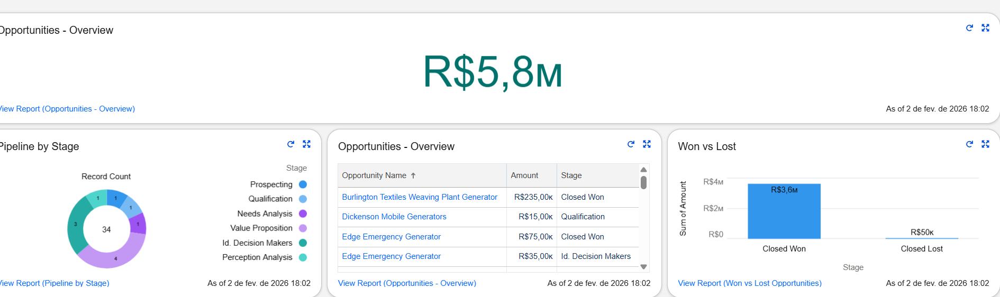

# 📊 Salesforce CRM Analytics — Sales Performance Overview

Este projeto demonstra a aplicação prática de **Salesforce CRM** no contexto de **Análise de Dados / Business Intelligence**, com foco em **vendas**, **pipeline comercial** e **performance de oportunidades**.

O objetivo é simular um cenário real de **Sales Ops / BI**, criando relatórios, dashboards e KPIs que apoiam a tomada de decisão de gestores comerciais.

---

## 🎯 Objetivo do Projeto

Responder perguntas estratégicas do negócio, como:

- Qual é a **receita total** gerada?
- Como o **pipeline de vendas** está distribuído por estágio?
- Qual é a proporção entre **oportunidades ganhas e perdidas**?
- Onde o time comercial deve focar seus esforços?

---

## 🛠️ Ferramentas Utilizadas

- **Salesforce CRM**
  - Reports
  - Dashboards
  - Trailhead Playground
- Conceitos de **Business Intelligence**
- Análise de **Pipeline de Vendas**
- KPIs de **Sales Performance**

---

## 📈 KPIs Analisados

- Receita Total (Total Revenue)
- Pipeline por Estágio
- Oportunidades Ganhas vs Perdidas (Won vs Lost)
- Valor financeiro das oportunidades
- Distribuição do funil de vendas

---

## 📊 Dashboard Salesforce

O dashboard final consolida os principais indicadores em uma visão executiva:

### 🔹 Total Revenue
Indicador de receita total baseada na soma do valor das oportunidades.

### 🔹 Pipeline by Stage
Distribuição do pipeline de vendas por estágio, permitindo identificar gargalos e oportunidades de melhoria no funil.

### 🔹 Won vs Lost Opportunities
Comparação entre oportunidades ganhas e perdidas, essencial para análise de performance e cálculo de win rate.

📸 **Dashboard final:**

---

## 🧠 Principais Insights

- A maior parte da receita está concentrada em oportunidades **Closed Won**, indicando boa taxa de conversão.
- Existem estágios do funil com menor volume de oportunidades, sugerindo possíveis gargalos no processo comercial.
- O comparativo **Won vs Lost** permite avaliar a eficiência do time de vendas e direcionar estratégias de melhoria.

---

## 📁 Estrutura do Repositório

salesforce-crm-analytics/
├── analysis/
│ └── business_questions.md
├── data/
│ └── data_description.md
├── dashboards/
│ ├── salesforce_dashboard_overview.png
│ ├── salesforce_pipeline_by_stage.png
│ └── salesforce_won_vs_lost.png
└── README.md

yaml
Copiar código

---

## 🚀 Próximos Passos

- Exportar dados do Salesforce para análise no **Power BI**
- Criar métricas de **Win Rate** e **Tempo Médio de Fechamento**
- Evoluir o projeto para um cenário de **Sales Forecast**

---
GitHub: https://github.com/murilofigueira88
